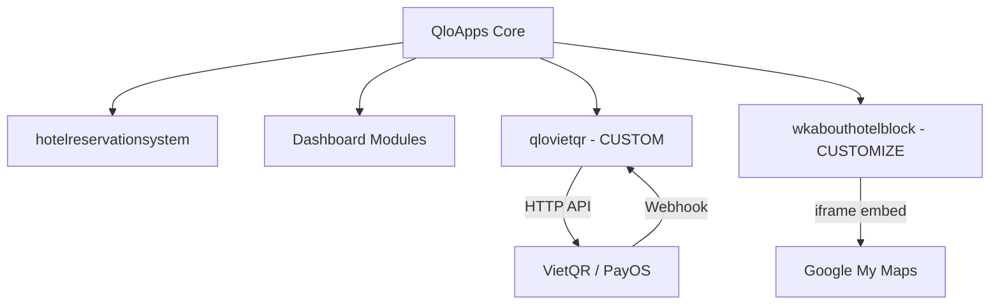

# Architecture Spine — CMS Hotel PMS

## Design Paradigm

**Modular Monolith** — QloApps (fork of PrestaShop 1.6). Tất cả custom work phải là QloApps Module (addon). Không patch core.

```
QloApps Core (read-only)
  ├── hotelreservationsystem (built-in: rooms, booking, calendar)
  ├── dashoccupancy / dashperformance (built-in: reports)
  ├── bankwire / cheque (built-in: payment stubs)
  └── modules/
       ├── qlovietqr/          ← CUSTOM: QR payment addon
       └── wkabouthotelblock/  ← CUSTOMIZE: Maps embed
```

## Invariants & Rules

### AD-1 — No Core Patching

- **Binds:** all custom work
- **Prevents:** merge conflicts on QloApps upgrades; forked codebase drift
- **Rule:** Custom code lives only in `modules/<module_name>/`. Override behavior via QloApps hooks, never edit files under `classes/`, `controllers/`, `config/`.

### AD-2 — Flat Multi-Branch via Hotel Entity

- **Binds:** FR-5, FR-6, FR-7
- **Prevents:** over-engineered multi-tenant DB isolation for 50 rooms
- **Rule:** Each branch = 1 QloApps Hotel entity. Data segregation via `id_hotel` foreign key. Employee permissions scoped to hotel. Single shared database. [ADOPTED — ponytail enforced]

### AD-3 — Single Payment Addon (qlovietqr)

- **Binds:** FR-12, FR-13
- **Prevents:** multiple payment gateway integrations; complex payment abstraction layer
- **Rule:** One module `qlovietqr` handles QR generation (VietQR/PayOS API call returning image URL) and webhook receipt. Webhook endpoint: `POST /module/qlovietqr/webhook`. Verify signature, update order status. No message queue. [ASSUMPTION: VietQR/PayOS supports webhook with signature]

### AD-4 — Single-Server Docker Compose Deployment

- **Binds:** all infrastructure
- **Prevents:** premature k8s/cloud-native complexity for a 50-room hotel
- **Rule:** `docker-compose.yml` with 3 services: `nginx`, `php-fpm`, `mysql`. Single VPS. No CI/CD pipeline — deploy via `git pull && docker compose up -d`.

### AD-5 — Google Maps Embed (iframe), Not JS API

- **Binds:** FR-11
- **Prevents:** paying for Maps API, managing API keys, writing JS code
- **Rule:** Create a Google My Maps with 3 pins. Embed via `<iframe>` in CMS block or `wkabouthotelblock` template. Zero API cost.



## Consistency Conventions

| Concern | Convention |
| --- | --- |
| Naming (modules) | Prefix `qlo` for custom modules (QloApps convention) |
| Data (dates) | MySQL `DATETIME` UTC, display in `Asia/Ho_Chi_Minh` |
| Data (currency) | VND, no decimal. Store as integer |
| State (order status) | Use QloApps built-in `OrderState` flow. Add `QR_PENDING` and `QR_PAID` states via module install hook |
| Auth | QloApps Employee system. No custom auth |
| Email | QloApps built-in `Mail::Send()` via SMTP (Sendgrid/Gmail). Transactional only |
| Language | Vietnamese (vi) as default. QloApps i18n built-in |

## Stack

| Name | Version |
| --- | --- |
| QloApps | latest (PrestaShop 1.6 fork) |
| PHP | >8.0 <8.5 |
| MySQL | 8.0+ |
| Nginx | stable |
| Docker Compose | v2 |
| jQuery | 1.11.0 (QloApps bundled) |

## Structural Seed

```text
/ (QloApps root — do not modify)
  modules/
    qlovietqr/                    # CUSTOM payment module
      qlovietqr.php               # Module class (install/uninstall hooks)
      controllers/
        front/
          webhook.php             # POST endpoint for payment callback
      views/
        templates/
          hook/
            payment.tpl           # QR code display at checkout
      translations/
        vi.php                    # Vietnamese strings
    wkabouthotelblock/            # EXISTING module — edit template only
      views/
        templates/
          front/
            abouthotelblock.tpl   # Add <iframe> Google Maps embed here
  docker-compose.yml              # NEW: nginx + php-fpm + mysql
  .env                            # NEW: DB creds, VietQR API key, SMTP config
```

## Capability → Architecture Map

| Capability | Lives in | Governed by |
| --- | --- | --- |
| Room & Category management (FR-1) | QloApps core + hotelreservationsystem | AD-1 (no core patch) |
| Booking CRUD (FR-2) | QloApps core | AD-1 |
| Real-time room grid (FR-3) | hotelreservationsystem | AD-1 |
| Guest CRM & VIP tag (FR-4) | QloApps Customer entity | AD-1, AD-2 |
| Employee permissions (FR-5) | QloApps Employee + Profile | AD-2 (hotel-scoped) |
| Multi-branch data (FR-6) | QloApps Hotel entity | AD-2 |
| Master Dashboard (FR-7) | dashoccupancy + dashperformance | AD-2 |
| Direct Booking (FR-8) | QloApps frontend | AD-1 |
| Email confirmation (FR-10) | QloApps Mail system | AD-1 |
| SEO & Maps (FR-11) | wkabouthotelblock + QloApps SEO | AD-5 |
| QR Payment (FR-12) | qlovietqr module | AD-3 |
| Webhook reconciliation (FR-13) | qlovietqr module | AD-3 |
| Revenue reports (FR-17) | Dashboard modules | AD-1 |
| Occupancy/RevPAR (FR-18) | dashoccupancy | AD-1 |
| CSV export (FR-19) | QloApps built-in export | AD-1 |

## Deferred

| Decision | Why it can wait |
| --- | --- |
| OTA Channel Manager (FR-9) | v2 backlog. QloApps has `qlochannelmanagerconnector` module ready when needed |
| AI Chatbot (FR-14/15/16) | v2 backlog. Manual Zalo/FB chat until volume justifies bot |
| SSL/HTTPS setup | Handled at deploy time via Let's Encrypt. Not an architecture decision |
| Backup strategy | Ops concern. `mysqldump` cron on VPS sufficient for 50 rooms |
| Monitoring/Logging | Not needed at this scale. QloApps has built-in admin logs |
| CDN | 50 rooms, local traffic. Add Cloudflare later if needed |
| Mobile App | PRD explicitly excludes. Responsive web only |
